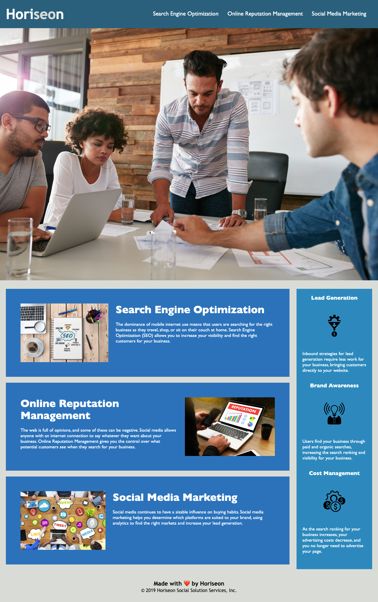

# Horiseon Accessibility Refactor

## Accessibility
Web accessibility is an increasingly important consideration for businesses. It ensures that people with disabilities can access a website using assistive technologies such as video captions, screen readers, and braille keyboards. Making a website accessible is also good for business for many reasons, one of them being that accessible sites are better positioned in search engines like Google. It also helps companies avoid litigation that can occur when people with disabilities can't access their website.

Even though accessibility is a broad topic that can include complex requirements, your tech lead has given you a small list of specific criteria to satisfy the project. These criteria are documented in the Acceptance Criteria section.

## Acceptance Criteria
GIVEN a webpage meets accessibility standards: 
WHEN I view the source code 
THEN I find semantic HTML elements 
WHEN I view the structure of the HTML elements 
THEN I find that the elements follow a logical structure independent of styling and positioning 
WHEN I view the image elements 
THEN I find accessible alt attributes 
WHEN I view the heading attributes 
THEN they fall in sequential order 
WHEN I view the title element 
THEN I find a concise, descriptive title 

## Screenshot of Application

## Location of Deployed Application
Check out the more accessible, search engine optimized site [here](https://jmcavaddy.github.io/accessibility-challenge-01/)!